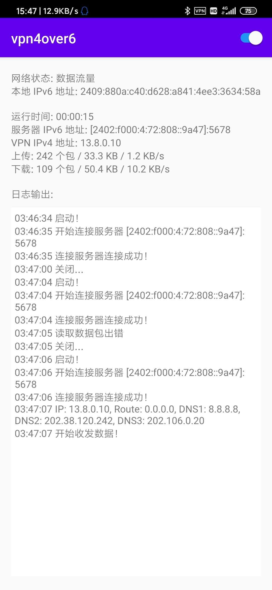

## VPN 4over6 客户端实验报告

### 实验目的

通过实现 IPv4 over IPv6 隧道最小原型验证系统，让同学们对 4over6 隧道的实验原理有更加深刻的认识。

### 实验原理

将安卓所有的非本地 IPv4 数据包通过与服务端的 IPv6 隧道进行收发。

1. 实现安卓界面程序，现实隧道报文收发状态（Java 语言）
2. 启用安卓 VPN 服务（Java 语言）
3. 实现底层通信程序，对 4over6 隧道系统控制消息和数据消息的处理（C 语言）

### 实验内容

整个流程和实验指导书上的大致相同：

1）绘制前端
2）用户点击启动按钮
3）前端通知 Vpn4Over6Service 进行连接
4）Vpn4Over6Service 创建一个子线程，和启动一个本地 socket 的 listener，监听后端的连接。本地 socket（后面称之为 logger）的连接建立后，就只用来前后端的信息通讯（取代了实验指导中的 pipeline），并非用来传输数据包；Vpn4Over6Service 还创建了另一个子线程，用 jni 运行后端的 c 代码，先运行 logger 的连接代码，再运行后端 IPv6 socket 的启动代码。
5）后端连接前端的 logger，然后再创建一个 IPv6 的 socket 连接服务端，并接受服务端发来的 IP 和 DNS 信息（type 101），通过 logger 传到前端，然后开始阻塞监听 logger 等待 /dev/tun 的文件描述符 fd 传过来
6）前端收到 IP 和 DNS 后，用 VpnService 内的 Builder 建立一个读写 /dev/tun 的 socket，将这个 socket 的 fd 通过 logger 传到后端
7）后端收到 /dev/tun 的 fd 后，通知前端可以收发数据了
8）前端再创建 3 个子线程：一个用来运行阻塞读取 /dev/tun 数据并包装成 type 102 发送给服务端的 c 代码；一个用来运行阻塞读取服务端发来的各种数据包并解析，若是 type 101 则写入到 /dev/tun 中，若是 type 104 则更新心跳包最后时间；一个用来定时（1s）发送心跳包，并将后端的统计数据（接受的数据包个数以及大小）通过 logger 传到前端。
9）若中途发生用户点击关闭按钮、连接关闭等传输错误、心跳包超时，连接终止，所有子线程有序关闭。

然后简要说一下每个文件的内容

#### 前端

Backend.java

包装 jni 的一些 c 方法

DataHandler.java

继承了 Handler，用于处理其他线程发送到 UI 线程的数据，分发到相应的绘制函数中

DataLoader.java

前后端通信的代码所在

FlowStat.java

将后端传来的网络传输状态包装成一个类实例

MainActivity.java

UI 的绘制

NetworkState.java

获取安卓手机的一些网络状态（比如是否支持 IPv6，以及获取本地 IPv6 地址）

Vpn4Over6Service.java

继承 VpnService，用于获取 /dev/tun 的文件描述符

#### 后端

client.c client.h

与服务端数据通信的代码

io.c io.h

简单的写了个阻塞读取/写入指定长度的数据函数

logger.c logger.h

与前端通过本地 socket 通信的代码

msg.c msg.h

定义客户端和服务端信息传输的结构体，并写了相应的读和写函数

main.c

jni 的入口代码

### 实验结果

#### 遇到的问题和解决方案

很多踩到的坑和问题（主要集中在 Android 开发上）都忘了，基本都是把输出拿去 Google 搜，基本就能搜出来，所以我就不写了。下面就写两个可能搜不到的。

1、在安卓虚拟机上尝试使用实验指导书中的 pipeline 进行前后湍通信，却失败了

好像是因为我机子的安卓虚拟机它那文件系统不支持管道。所以我前后端的通信换成了本地 socket

2、手机建立好 VPN 连接后，Android Studio 收不到 log.d 这种调试函数的输出了

似乎是因为这个 adb 调试也是通过 socket 来传输数据的，然后由于没有保护这个 socket，导致被后端捕获发到了...服务端去了，然后也没收到相应的回应？

不太懂怎么解决，最后我自己在前端写了个 logger 的显示界面，用自己的 local socket 来传输后端的调试信息，然后输出到 UI 上

### 实验总结和建议

本次实验最大的感受就是，实验原理有点简单，但却花了很多时间去学习 Android 开发的一些知识，感觉主次轻重有点不太对...？

希望助教今后可以尝试提供前端代码，让同学去实现后端的逻辑，然后将实验原理加强一下。

总的来说，本次实验还是让我学到了不少的网络原理和应用开发的知识的，感谢老师和助教的教学和指导！
